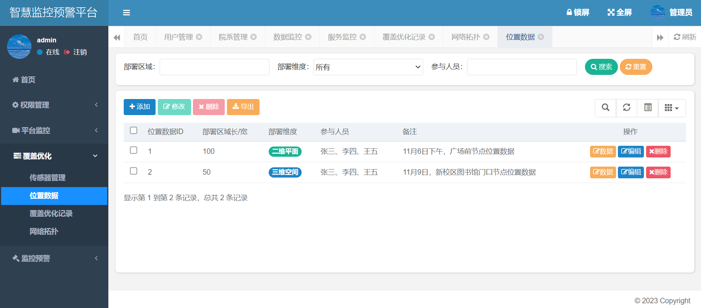
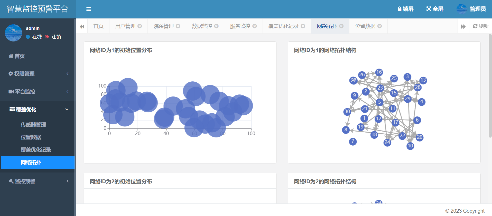
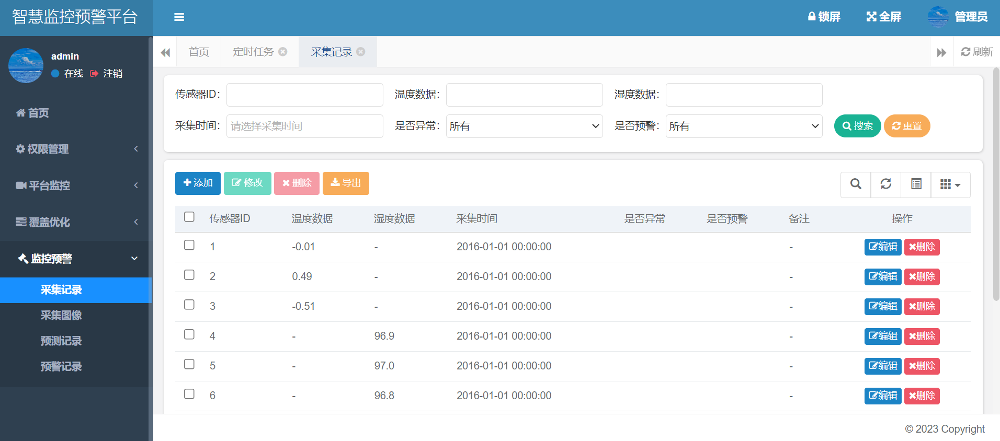
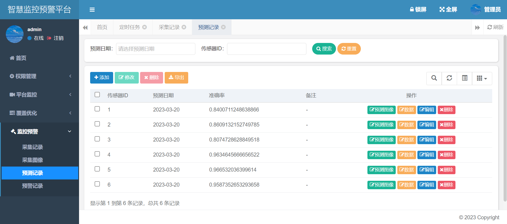
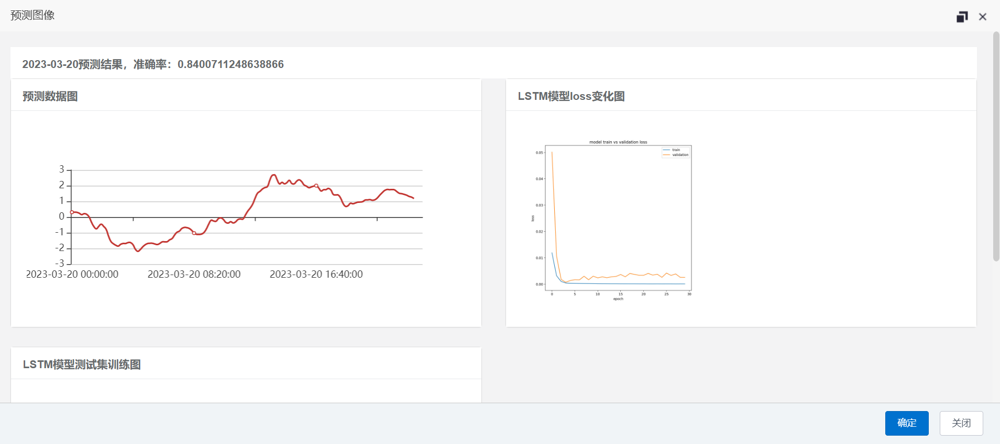
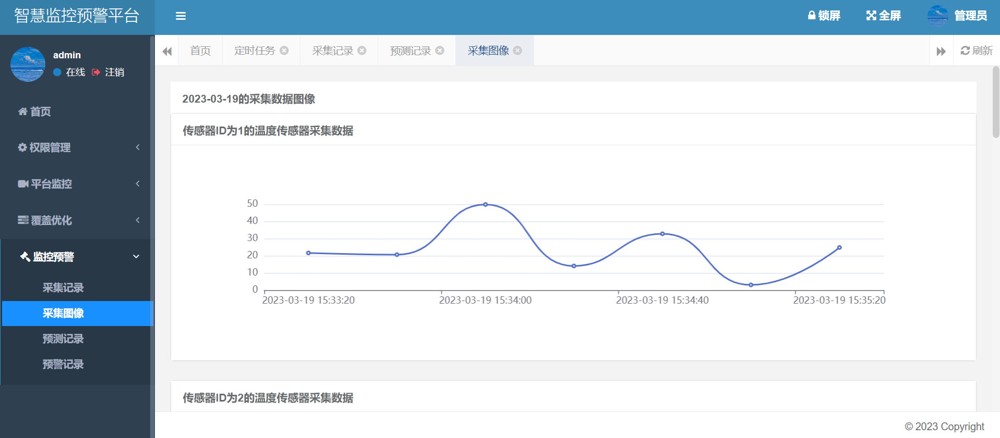

## 平台简介

随着物联网、云计算、大数据等技术的迅猛发展，智慧城市、智慧工厂等智慧应用场景已经成为了当今社会发展的热点。

智慧工厂建设是未来发展的方向之一，其中智慧监控平台作为智慧工厂的重要组成部分，已经在工厂管理、公共安全、交通管理等领域发挥了重要作用。

智慧监控平台通过部署传感器、视频监控设备等技术手段，实现对工厂环境、设施设备、公共安全等方面的全方位、多维度实时监测，并通过数据采集、存储、处理等手段，为管理者提供决策支持和预警机制，以保障工厂的稳定、安全和发展。

然而，随着工厂规模的不断扩大，智慧监控平台面临着越来越复杂的环境和任务，其中的监控数据量也越来越大。

如何更加高效地管理和利用这些数据，成为智慧监控平台需要解决的一个重要问题。

同时，为了进一步提高监控预警的精度和及时性，需要采用更加先进的算法和模型，使得监控预警平台能够更加准确地识别异常情况，并及时进行预警和处理。

并且，传统的监控预警平台普遍存在着一些问题，例如无法快速准确地预测异常情况、难以应对复杂多变的环境等。

而灰狼优化算法(Grey Wolf Optimization, GWO)和长短期记忆网络(Long-Short Term Memory, LSTM)算法分别具有优秀的全局搜索能力和序列预测建模能力，可以有效地解决这些问题。

GWO算法是一种基于群体智能的优化算法，其模拟了灰狼群的狩猎行为，通过不断地协作和竞争，最终找到全局最优解。

而LSTM算法是一种深度学习模型，可以有效地对序列数据进行建模和预测。本选题将GWO算法和LSTM算法结合起来，设计了一种智慧监控预警平台，可以有效地应对复杂多变的环境，提高监控预警的准确性和实时性。

## 内置功能

权限管理：

1. 用户管理：用户是平台操作者，该功能主要完成平台用户配置。
2. 角色管理：角色菜单权限分配、设置角色按院系进行数据范围权限划分。
3. 菜单管理：配置平台菜单，操作权限，按钮权限标识等。
4. 院系管理：配置院系组织机构，树结构展现支持数据权限。
5. 岗位管理：配置平台用户所属担任职务。
6. 字典管理：对平台中经常使用的一些较为固定的数据进行维护。
7. 参数管理：对平台动态配置常用参数。

平台监控：

8. 在线用户：当前平台中活跃用户状态监控。
9. 定时任务：在线（添加、修改、删除)任务调度包含执行结果日志。
10. 数据监控：监视当前平台数据库连接池状态，可进行分析SQL找出平台性能瓶颈。
11. 服务监控：监视当前平台CPU、内存、磁盘、堆栈等相关信息。
12. 缓存监控：对平台的缓存查询，删除、清空等操作。
13. 操作日志：平台正常操作日志记录和查询；平台异常信息日志记录和查询。
14. 登录日志：平台登录日志记录查询包含登录异常。

覆盖优化：

15. 传感器管理：对监控的传感器进行管理。
16. 位置数据：传感器的详细位置数据。
17. 覆盖优化记录：应用GWO对传感器的位置进行覆盖优化。
18. 网络拓扑：显示各个网络的拓扑情况及数据流向。

监控预警：

19. 采集记录：对传感器采集到的数据进行维护。
20. 采集图像：对传感器每日的采集数据进行可视化操作。
21. 预测记录：使用LSTM对传感器下一日的数据进行预测。
22. 预警记录：平台预警信息发布维护。

## 平台效果图

<table>
    <tr>
        <td></td>
        <td></td>
    </tr>
    <tr>
        <td></td>
        <td></td>
    </tr>
    <tr>
        <td></td>
        <td></td>
    </tr>
    <tr>
        <td></td>
        <td></td>
    </tr>
    <tr>
        <td></td>
        <td></td>
    </tr>
    <tr>
        <td></td>
        <td></td>
    </tr>
    <tr>
        <td></td>
        <td></td>
    </tr>

</table>
