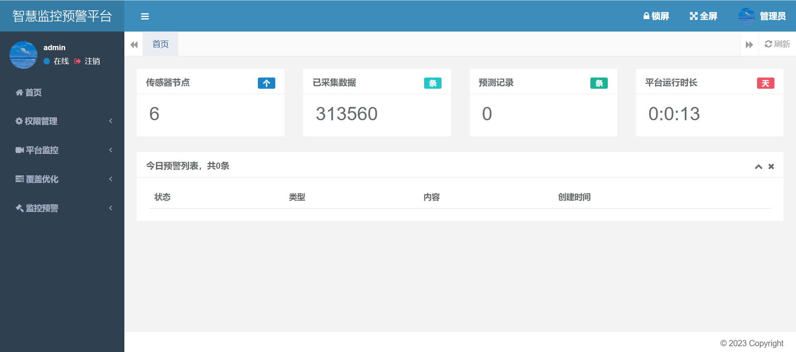
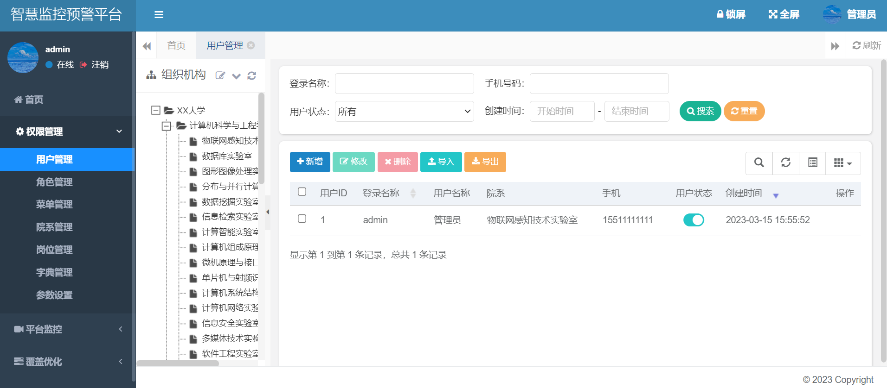
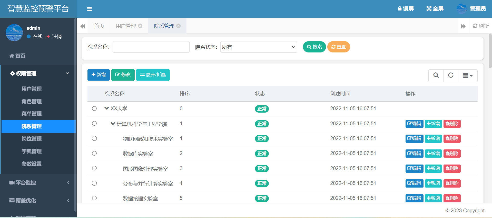
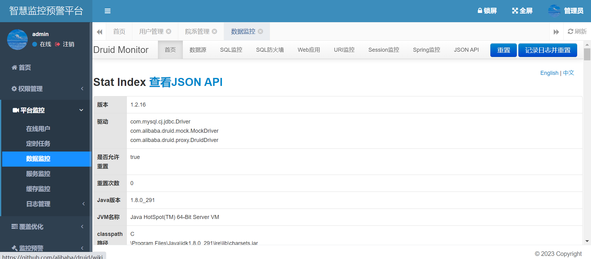
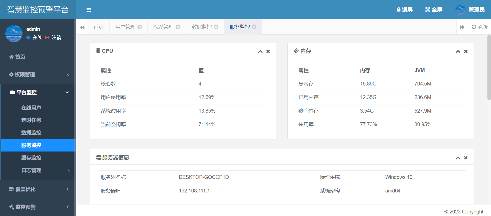
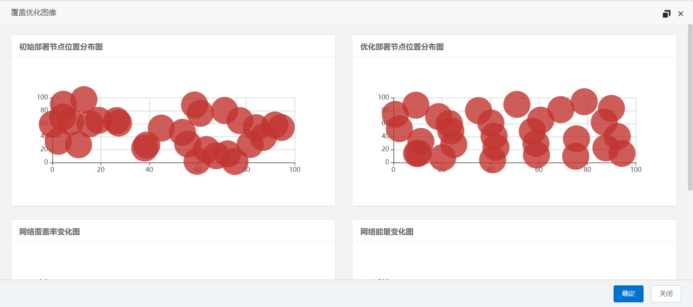
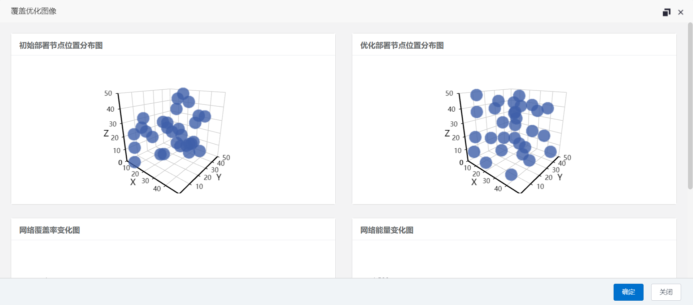

## 平台简介

覆盖优化是无线传感器网络研究中的一项重要且有趣的任务，旨在提高网络的覆盖率、降低网络的能耗以优化网络的服务质量。

针对能量异构无线传感器网络中节点随机部署时，节点冗余造成覆盖率低的问题，提出一种基于改进灰狼优化和贪婪算法的两阶段异构无线传感器网络覆盖优化方法。

首先，将静态节点和移动节点随机部署在目标区域内；

其次，根据节点的初始能量、剩余能量和虚拟移动距离建立多因素协同适应度函数，提出猎物权重因子动态分配策略，确定移动节点的初选位置序列；

最后，在终选位置优化阶段，根据节点数目/移动距离原则、能量原则和终选位置交换原则，提出贪婪算法确定节点与初选位置的最优匹配，重新进行节点部署，从而完成覆盖优化。

在实验数据的基础上，自动生成仿真结果，将实验所需的初始位置分布图、优化位置分布图、覆盖率与迭代次数变化图、网络剩余能量与迭代轮次变化图，实时展示在页面上，加快了数据的分析工作。

## 内置功能

平台管理：

1. 字典管理：对系统中经常使用的一些较为固定的数据进行维护。
2. 参数管理：对系统动态配置常用参数。
3. 通知：系统通知信息发布维护。
4. 操作日志：系统正常操作日志记录和查询；系统异常信息日志记录和查询。
5. 登录日志：系统登录日志记录查询包含登录异常。

权限管理：

11. 用户管理：用户是系统操作者，该功能主要完成系统用户配置。
12. 院系管理：配置院系组织机构，树结构展现支持数据权限。
13. 岗位管理：配置系统用户所属担任职务。
14. 菜单管理：配置系统菜单，操作权限，按钮权限标识等。
15. 角色管理：角色菜单权限分配、设置角色按机构进行数据范围权限划分。

平台监控：

16. 在线用户：当前系统中活跃用户状态监控。
17. 定时任务：在线（添加、修改、删除)任务调度包含执行结果日志。
18. 服务监控：监视当前系统CPU、内存、磁盘、堆栈等相关信息。
19. 缓存监控：对系统的缓存查询，删除、清空等操作。
20. 连接池监视：监视当前系统数据库连接池状态，可进行分析SQL找出系统性能瓶颈。

## 平台效果图

<table>
    <tr>
        <td></td>
        <td></td>
    </tr>
    <tr>
        <td></td>
        <td></td>
    </tr>
    <tr>
        <td></td>
        <td></td>
    </tr>
    <tr>
        <td></td>
        <td></td>
    </tr>
    <tr>
        <td></td>
        <td></td>
    </tr>
</table>
